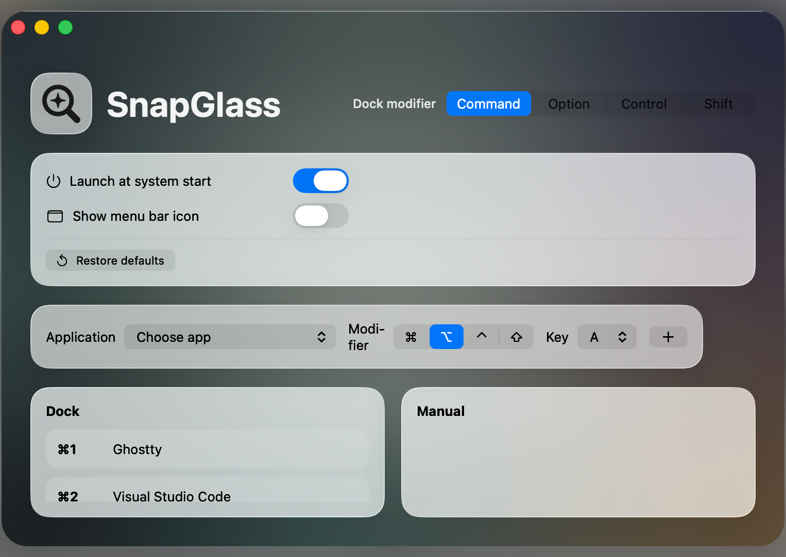

# SnapGlass

SnapGlass is a small Apple silicon macOS menu bar app inspired by Snap.



It provides:

- automatic Dock shortcuts using a selected modifier plus number keys
- manual shortcuts for any installed app
- app peeking, where pressing a shortcut again shortly after activation hides the app
- a macOS 26 Liquid Glass preferences window

## Requirements

- Apple silicon Mac
- macOS 26 or newer
- Xcode 26.5 or newer

## Development

```sh
swift test
swift run SnapGlass
```

If SwiftPM attempts to write module cache files outside the repository in a restricted environment:

```sh
env CLANG_MODULE_CACHE_PATH="$PWD/.build/clang-module-cache" swift test
```

## Package App

```sh
Scripts/package-app.sh
open .build/SnapGlass.app
```

The app is packaged as `arm64` only.

## Install With Homebrew

```sh
brew tap leros1337/tap
brew install --cask snap-glass
```

## Package DMG

```sh
Scripts/package-dmg.sh
open .build/dist/SnapGlass-0.1.0.dmg
```

The DMG contains `SnapGlass.app` and an `/Applications` shortcut. Drag the app onto the shortcut to install it.

To package a specific version:

```sh
SNAPGLASS_VERSION=1.2.3 SNAPGLASS_BUILD=42 Scripts/package-dmg.sh
```

## GitHub Release

The `Release` workflow can be started from GitHub Actions with `workflow_dispatch`.

Inputs:

- `version`: release version without `v`, for example `1.2.3`
- `prerelease`: mark the release as prerelease
- `draft`: create the release as a draft

The workflow runs on GitHub's public `macos-26` arm64 runner, builds and tests the app, packages `SnapGlass-<version>.dmg`, uploads it as a workflow artifact, and attaches it to a GitHub release tagged `v<version>`.

## License

Apache License 2.0. See `LICENSE`.
